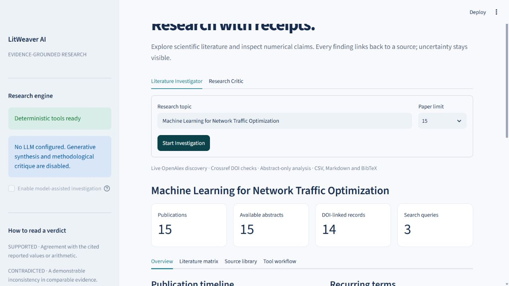
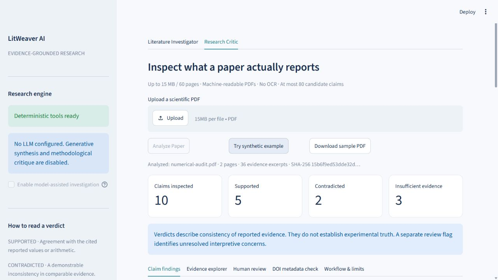
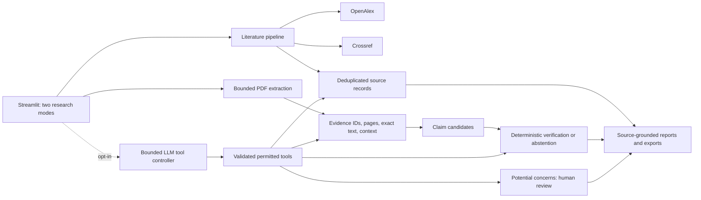

# LitWeaver AI

**Evidence-grounded scientific literature discovery and research verification.**

LitWeaver is a working Python/Streamlit research assistant with two modes: live literature discovery and conservative, source-linked PDF claim checking. It makes paid LLMs optional and distinguishes a numerical inconsistency from an unverified methodological concern.

> This is an MVP research aid, not a validated peer-review system. A supported verdict means agreement with cited reported values or arithmetic, not independent confirmation of scientific truth.

## The problem

Research assistants can produce plausible summaries with invented citations or overlook the distinction between an abstract, a full paper and an experiment. LitWeaver instead keeps real publication records, exact source excerpts, document hashes and page references attached to its results. When the available text cannot support a conclusion, it abstains.

## Working features

| Literature Investigator | Research Critic |
|---|---|
| Live OpenAlex searches using three query variants | PyMuPDF text extraction with actual 1-based PDF page locations |
| Crossref metadata enrichment for up to five DOI-bearing records | Recognizable section labels and bordered machine-readable tables |
| DOI/title-year deduplication and transparent relevance ranking | Source-linked numerical and interpretive claim candidates |
| Abstract-only extractive comparison matrix | Numerical comparison and percentage/percentage-point checks |
| Source library, timeline and recurring-term observations | Context-aware consistency checks and rounding abstention |
| CSV, Markdown and BibTeX downloads | Markdown and complete evidence/result JSON downloads |
| Optional model-selected search, quote selection and research questions | Optional model-selected tools and quote-grounded human-review concerns |

No model is required for either baseline mode. Generative research questions and interpretive model review are **explicitly disabled** until a provider and model are configured and enabled in the sidebar.

## Screenshots

Actual local browser captures, with real literature results and the labelled synthetic PDF fixture:





## Quick start

Requires Python 3.11 or newer; the tested environment uses Python 3.12.

```bash
python -m venv .venv
# Windows PowerShell:
.venv\Scripts\Activate.ps1
# macOS/Linux instead: source .venv/bin/activate
python -m pip install -r requirements.txt
python -m streamlit run app.py
```

Open the URL printed by Streamlit. In Research Critic, choose **Try synthetic example** to inspect a two-page PDF with intentionally planted errors. The fixture is labelled synthetic throughout; it is not a real publication.

`requirements-lock.txt` records the exact installed Python 3.12 dependency versions from validation. Use `python -m pip install -r requirements-lock.txt` to reproduce that environment. The sample PDF is included; regenerating it with `scripts/generate_demo.py` additionally requires the optional development package `reportlab`.

For a literature search, try `Machine Learning for Network Traffic Optimization`. Results are fetched live, so rankings and available records can change. OpenAlex may impose anonymous-use limits; an optional free key can be configured. If OpenAlex fails or yields no usable records, Crossref fallback results are explicitly labelled.

Copy `.env.example` to `.env` for optional configuration. Never put real keys in Git.

## Optional LLM integration

The controller sends genuine tool definitions and processes the provider's `tool_calls`. It does not simulate an LLM by relabelling rules. Supported transports are an OpenAI-compatible Chat Completions endpoint and Ollama's native `/api/chat` endpoint.

```dotenv
LLM_PROVIDER=openai_compatible
LLM_BASE_URL=https://your-compatible-provider.example/v1
LLM_MODEL=your-tool-capable-model
LLM_API_KEY=your-private-key
```

For a locally installed Ollama model that supports tool calling:

```dotenv
LLM_PROVIDER=ollama
LLM_BASE_URL=http://localhost:11434
LLM_MODEL=your-installed-tool-capable-model
LLM_API_KEY=
```

Enable **model-assisted investigation** in the sidebar. This transmits selected abstracts or PDF excerpts to the configured endpoint; local Ollama can keep inference on the host. HTTPS is required except for loopback HTTP. On cloud hosting, `localhost` means the cloud container, not your personal computer.

The provider needs tool support and compatibility with the configured transport. Provider failures leave deterministic results intact. Protocol behavior, bounds and fabricated-quote rejection are tested with explicit test doubles. **No live LLM run has been verified in this workspace because no provider/model credentials or local Ollama installation were configured.**

## Architecture



Modules are deliberately small:

- `scholarly.py`: real metadata requests, retries, cache, DOI normalization, deduplication, ranking and metadata checks.
- `pdf.py`: text, sections and tables with document provenance; explicit processing limits.
- `verification.py`: heuristic claims, candidate retrieval, numerical facts, deterministic verdicts and trace events.
- `agent.py`: provider transport, Pydantic argument validation, tool registry and bounded loop.
- `reports.py`: extractive matrix, Markdown, CSV formula protection and escaped BibTeX.
- `models.py`: typed publication, evidence, claim, result and workflow records.

### Agent workflow

The baseline pipeline always completes independently of a model. An enabled model may then select from tools such as `search_papers`, `retrieve_publication_metadata`, `extract_pdf_text`, `extract_scientific_claims`, `propose_scientific_claim`, `retrieve_claim_evidence`, `verify_numerical_claim`, `verify_publication_metadata`, `generate_comparison_matrix`, and `generate_investigation_report`.

The loop allows at most eight model steps and 12 tool calls, rejects repeated identical calls, limits response/context size, uses network timeouts and checks a 120-second loop deadline between calls. A running network/tool call can finish after that deadline. It cannot execute Python, shell commands or arbitrary filesystem operations. Source text is marked as untrusted data. Quotes and identifiers are checked against stored records; proposed claims must preserve the full source excerpt, including negation. Free-form model prose never sets a verdict or becomes a verified report.

Tool calls are visible in the dashboard. Model-selected calls are separated from deterministic calls. Exact-quote validation establishes provenance, **not** that the model's interpretation is correct.

## Verification contract

Every result contains the original claim, one of `SUPPORTED`, `CONTRADICTED`, or `INSUFFICIENT_EVIDENCE`, explanation, source evidence, pages, method, calculation when available, and limitations. A separate `review_required` flag carries interpretive concerns.

The MVP recognizes deliberately narrow numerical phrasing, for example:

```text
[context: demo/test/run1] Model A accuracy = 87.4%.
[context: demo/test/run1] Model B accuracy = 84.2%.
[context: demo/test/run1] Model B achieved higher accuracy than Model A.

Accuracy improved by 12% from 80.0% to 92.0%.
```

The comparison is contradicted by the reported values. The change is 15% relative, or 12 percentage points. Arithmetic agreement does not independently verify its operands.

Supported checks:

- Higher/lower/better/worse/equal comparisons of named `Model A`-style entities, a recognized metric, explicit units and matching context.
- Relative percentage changes and percentage-point differences, with displayed-precision checks and zero-baseline abstention.
- Different reported values for the same model/metric/unit/context; the system flags inconsistency without deciding which value is true.
- Crossref DOI/title/year agreement. Bibliographic mismatches receive a review flag; date differences can reflect online versus print publication.

Recognized metrics include accuracy, precision, recall, F1, error rate, latency, runtime, cost, throughput and AUC. The direction of improvement is explicitly encoded. Units are not silently converted. Table checks require an unambiguous `Model` column, metric/unit header such as `Accuracy (%)`, and a context column or disclosed analyst-confirmed context.

Natural text context such as `on dataset Demo (test split, run 1)` is recognized. Across snippets, missing context causes abstention. The Evidence explorer lets the user select excerpts and confirm a shared dataset/split/setting; that assumption is recorded in document warnings and verification limitations. Different or ambiguous contexts are not automatically pooled.

**Coverage is limited.** Arbitrary model names, complex clauses, implied units, statistical significance, figures and broad scientific conclusions generally require human review. A real six-page paper tested through the interface yielded candidate claims but all abstained with the baseline grammar; that is a coverage limitation, not validation of the paper. Optional model concerns can assist review but cannot convert unsupported language into numerical proof.

## Evaluation and actual validation

Run:

```bash
python -m pytest -q
python -m evaluation.run
python scripts/smoke.py
```

`evaluation/cases.json` contains 20 synthetic claim/evidence inputs. Expected verdicts and calculation checks live separately in `evaluation/expected.json`; expected outputs are never passed into the verifier. `evaluation/results.json` stores the actual predictions and metrics.

The recorded evaluation achieved:

| Metric | Result |
|---|---:|
| Verdict accuracy | 20/20 (100%) |
| Numerical verdict/calculation correctness | 11/11 (100%) |
| Evidence-reference validity and required evidence presence | 20/20 (100%) |
| Expected abstentions | 9/9 (100%) |

These are small, hand-authored cases exercising the supported grammar. They do **not** measure performance across unrestricted papers, establish scientific reliability, or constitute a validated peer-review benchmark. See [evaluation details](docs/EVALUATION.md) and the machine-readable results for exact definitions.

The real API smoke test retrieved **10 OpenAlex publications with 10 available abstracts**, plus Crossref enrichment, with no API warnings. Actual source records and exports are saved in `examples/output/`. The PDF smoke test uses the labelled synthetic two-page fixture and detects both planted numerical errors. The final test count and execution record are in `docs/VALIDATION.md`.

## Limits and data handling

- Upload limit: 15 MB; maximum 60 pages, 300,000 extracted characters, 2,500 evidence items and 80 candidate claims. A 30-second extraction deadline is checked between pages/table calls; it is not an OS-level timeout for a native parser call.
- No OCR, figure interpretation, image-derived numbers or reconstruction of uncertain tables. Borderless and complex tables can be missed. Multi-column reading order is heuristic.
- PDF page references are actual file-page positions, which may differ from printed page labels. Section headings are heuristics. Bounding boxes refer to the extracted text block, not an exact sentence outline.
- Uploaded PDFs are processed in memory and are not deliberately saved by the application. Results stay in the Streamlit session until cleared or expired; the application is not an authenticated multi-tenant document repository.
- Literature analysis uses metadata/abstracts only. Missing fields remain missing; a snippet may not capture all methods or limitations. Query variants and ranking are deterministic heuristics, not a systematic-review search strategy.
- A genuine DOI does not establish that a paper is correct, high quality, unretracted, or relevant to a claim. Available OpenAlex retraction flags are surfaced but are not a comprehensive retraction check.
- External evidence for uploaded-paper claims is not automatically retrieved. The critic primarily checks internal consistency; the DOI tab checks user-transcribed reference metadata separately.
- No paid API is needed for basic operation. Optional providers impose their own quotas, costs, terms and privacy policies. Keys belong in environment variables or hosting secrets, not source control.
- PDF parsing is in-process. A hardened public service should add worker isolation, stronger resource limits, authentication and per-user quotas before accepting untrusted uploads at scale.

## Deployment and repository status

The code is prepared for Streamlit Community Cloud and container deployment. See [deployment instructions](docs/DEPLOYMENT.md). The local app is not a public deployment. No public URL is claimed until it has been deployed and verified.

GitHub repository: [shihabbk18/litweaver-ai](https://github.com/shihabbk18/litweaver-ai). Publication was explicitly authorized by the project owner. The repository contains source code, reproducible tests, the labelled synthetic fixture and example metadata exports; it excludes credentials, virtual environments and user-uploaded papers.

## Future research directions

- Evaluate claim extraction and abstention on independently annotated real papers, including negative and adversarial examples.
- Expand numerical grammar and entity linking while maintaining dataset, split, run, unit and uncertainty alignment.
- Add rigorously tested table-header and experimental-context extraction, with analyst correction workflows.
- Retrieve external evidence with claim-to-passage provenance and distinguish internal consistency from independent replication.
- Measure uncertainty calibration, false contradiction rate, and reviewer usefulness instead of optimizing only synthetic accuracy.
- Add isolated PDF workers and deployment-level access controls for sensitive research documents.

## API references

- [OpenAlex authentication and limits](https://help.openalex.org/api/authentication/)
- [Crossref REST API](https://www.crossref.org/documentation/retrieve-metadata/rest-api/)
- [PyMuPDF text and table APIs](https://pymupdf.readthedocs.io/en/latest/page.html)
- [Ollama tool calling](https://docs.ollama.com/capabilities/tool-calling)
- [Streamlit Community Cloud deployment](https://docs.streamlit.io/deploy/streamlit-community-cloud/deploy-your-app/deploy)
